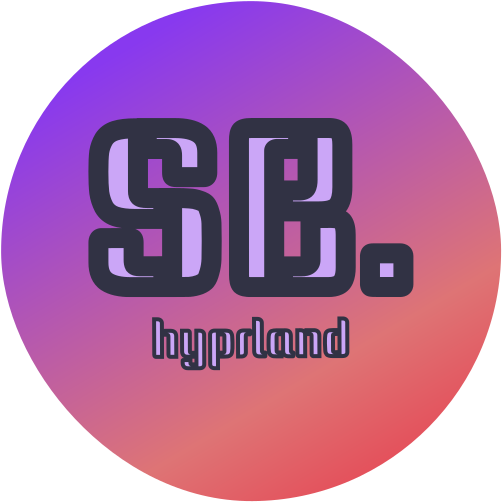

  
  <h1>SBDots</h1>
  
A Modern, Feature-Rich, and Polished Hyprland Setup

  
   
  
  

 

Welcome to SBDots, an opinionated, modern and feature-rich desktop setup for [Hyprland](https://github.com/hyprwm/Hyprland) written primarily in Python.

It’s not a full desktop environment, but it provides the essentials you actually use: status bar, app launcher, notifications, and few other core desktop utilities.

The goal is a clean, usable Hyprland setup that stays simple, structured, and easy to maintain.

## Installation

> [!NOTE]
>  As of now, **SBDots** is supported and tested for **Arch Linux** only; Arch-based distributions may work, they are not tested.

> [!WARNING]
> This will be released on AUR, but for now, you could use the **install.sh** but it isn't fully tested, so use it at your own risk.

## Contributing

Contributions are always welcome!

See [CONTRIBUTING.md](https://github.com/sbalghari/sbdots/blob/main/CONTRIBUTING.md) for ways to get started.

If you encounter any issues or have ideas for improvements, please feel free to open an issue or submit a pull request.

## License

This project is licensed under the GPL-3.0 license. For more details, please refer to the [LICENSE](https://github.com/sbalghari/sbdots/blob/main/LICENSE) file.
